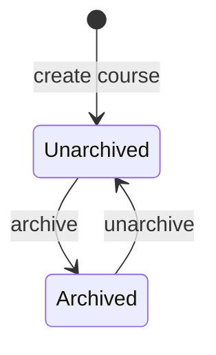
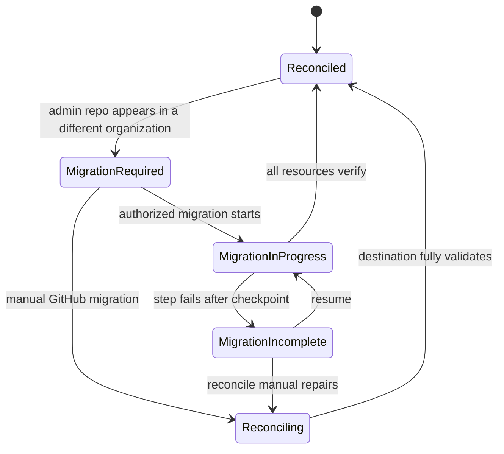
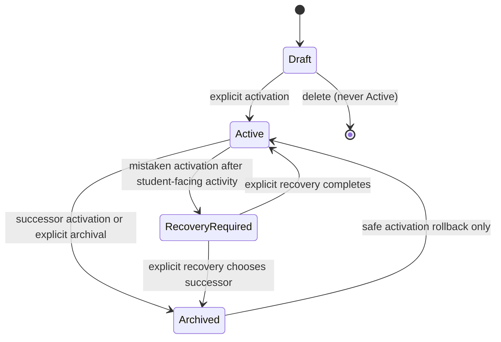
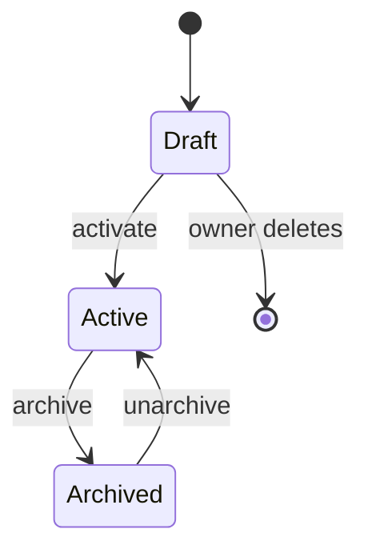
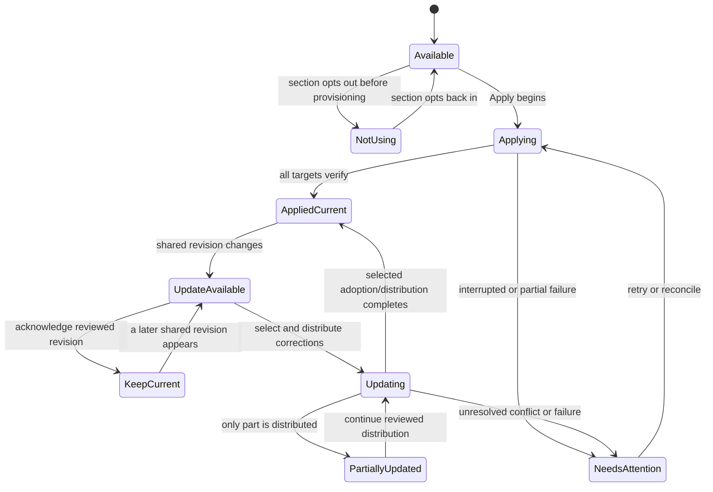
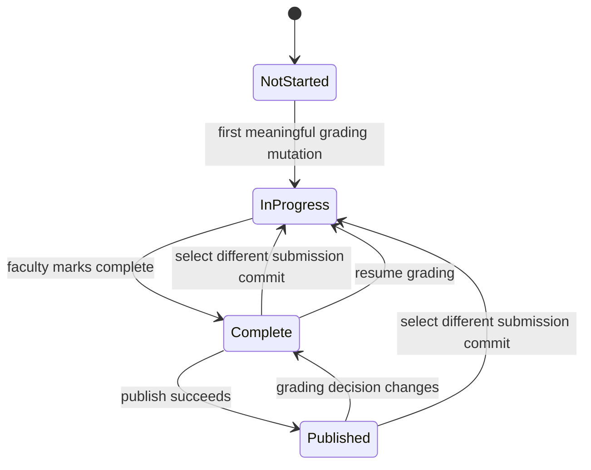
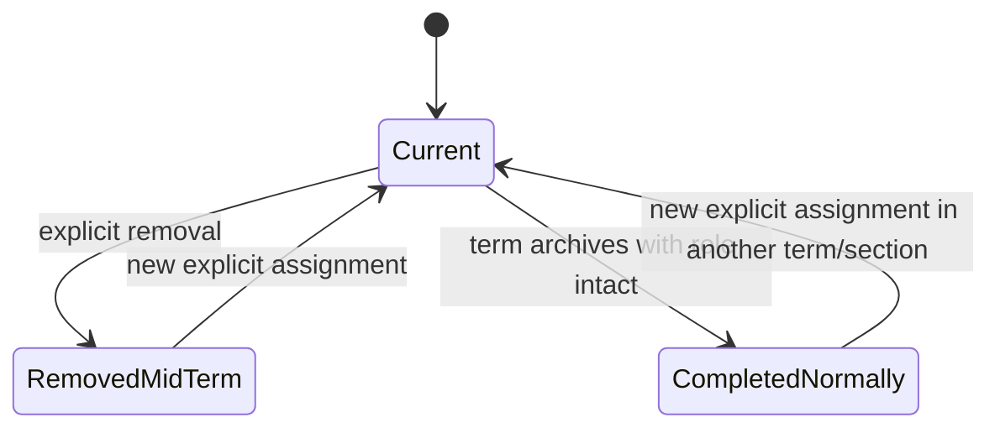

# Graider Lifecycle State Models

**Status:** implementation-facing state/transition contract

**Authority:** [remote course architecture](graider-remote-course-architecture.md)

**Related:** [authorization matrix](graider-authorization-matrix.md),
[schema-v2 design](graider-schema-v2-design.md)

## 1. Modeling conventions

The diagrams show domain transitions, not UI navigation or Git operations.
Authorization is always resolved from the actor's immutable GitHub user ID and
the persisted role history. A transition is successful only after the
course/admin repository mutation has synchronized, validated, committed, and
pushed successfully. Multi-system GitHub work records desired state and may
finish later through reconciliation.

Several visible labels are projections of orthogonal fields. In particular,
course archive state is independent of organization migration state, and a
section assignment's usage, provisioning, revision review, and distribution
progress must not be collapsed into one lossy status enum.

## 2. Course lifecycle and migration condition

### 2.1 Shared archive lifecycle

| Transition            | Initiator                                                     | Guards                                                                                             | Reversible                | Important side effects                                                                                                                                                                          |
| --------------------- | ------------------------------------------------------------- | -------------------------------------------------------------------------------------------------- | ------------------------- | ----------------------------------------------------------------------------------------------------------------------------------------------------------------------------------------------- |
| Create → Unarchived   | Authenticated course creator                                  | Existing organization selected; required repository/team privileges validated before partial setup | No normal course deletion | Creator enters faculty directory and becomes fallback administrator; private admin repository, initial Draft term, managed teams, branch protection, topic, and synchronization are established |
| Unarchived → Archived | Fallback administrator or coordinator of the most recent term | No Active term and no unresolved Draft term; no migration block                                    | Yes                       | Shared remote archive flag changes; course remains synchronized and available through Show archived                                                                                             |
| Archived → Unarchived | Same authorities                                              | Authentication, sync, valid schema, no migration block                                             | Yes                       | Enables creation of terms/assignments; does not reactivate an old term                                                                                                                          |

Course archive is shared remote state. Machine-local hide/show is not a course
state and never controls whether the managed clone exists or synchronizes.
There is no normal permanent Delete course transition.

### 2.2 Organization migration condition

`Reconciled`, `MigrationRequired`, `MigrationInProgress`, and
`MigrationIncomplete` are independent of `Unarchived`/`Archived`. A repository
or organization rename under the same immutable course/admin repository ID
stays Reconciled and only refreshes locator metadata.

Migration required/incomplete blocks normal course mutations. Planning is
read-only. Execution is previewed and checkpointed; verified completed work is
retained on failure. Reconciliation updates Graider metadata only after the
destination repositories, managed teams, memberships, permissions, and other
organization-bound resources validate. Exact role authority to initiate and
reconcile migration is not assigned by the approved requirements and remains
an explicit decision; see the [authorization matrix](graider-authorization-matrix.md#9-organization-migration-and-reconciliation).

## 3. Term lifecycle

The `Archived → Active` arrow is not ordinary reactivation. It represents the
special rollback of a mistaken activation while the newly activated term has
no student-facing activity. An implementation may model activation transaction
and recovery checkpoints outside the lifecycle enum; it must not expose an
ordinary “reactivate archived term” command.

### 3.1 Term transition contract

| Transition                          | Initiator                                                                                          | Guards/preconditions                                                                                      | Reversible                               | Important side effects                                                                                                       |
| ----------------------------------- | -------------------------------------------------------------------------------------------------- | --------------------------------------------------------------------------------------------------------- | ---------------------------------------- | ---------------------------------------------------------------------------------------------------------------------------- |
| Create Draft                        | Coordinators of most recently created term, or fallback administrator                              | Course unarchived; schema compatible; no migration block                                                  | Draft may be deleted                     | Creates preparatory term scope and desired roles; no student-facing work                                                     |
| Draft → Active                      | Current Active-term coordinator or fallback administrator; fallback administrator for initial term | Explicit action; complete valid Draft; no unsupported schema/migration block; atomic single-Active update | Only by safe rollback guard below        | Previous Active becomes Archived; coordinator/faculty permissions and dashboards switch; desired-state reconciliation begins |
| Active → Archived during activation | Same actor as activation                                                                           | Happens in same logical transaction as successor Draft → Active                                           | Only as part of safe activation rollback | Preserves history and eligible late grading/regrading rights                                                                 |
| Draft → Deleted                     | Current-term coordinator, fallback administrator, or—if no Active term—a coordinator of that Draft | Term has never been Active                                                                                | No normal recovery except Git checkpoint | Removes only Draft data; student repos cannot exist from Draft operations                                                    |
| Mistaken activation rollback        | Authorized activation/recovery actor                                                               | Newly activated term has no student-facing activity                                                       | Special one-time recovery                | Restores one Active term and prior authorization desired state without erasing activation history                            |
| Active → Recovery required          | Recovery workflow                                                                                  | Student-facing activity exists, so safe rollback guard fails                                              | Resolved only explicitly                 | Blocks simplistic rollback and preserves all activity for deliberate recovery                                                |

### 3.2 Term invariants

1. Exactly one term is Active. Activation must never expose an intermediate
   durable state with two Active terms.
2. Draft terms permit configuration, sections, faculty, rosters, assignments,
   schedules, and grading-workflow preparation, but prohibit Apply,
   student-repository mutations, grading dispatch/grading, and publication.
3. Dates never activate terms automatically.
4. `has_ever_been_active` or equivalent history is irreversible. Once Active,
   a term is normally retained as Archived rather than deleted.
5. Archived terms freeze ordinary section, roster, assignment structure,
   deadline, and faculty changes. Normally completed faculty retain authorized
   grading/regrading/publication rights; faculty removed mid-term do not.
6. Remote manual deletion of old Archived term data is authoritative; a stale
   local cache must not recreate it.

## 4. Assignment lifecycle

| Transition        | Initiator                                                   | Guards/preconditions                                                             | Reversible                                                 | Important side effects                                                                                              |
| ----------------- | ----------------------------------------------------------- | -------------------------------------------------------------------------------- | ---------------------------------------------------------- | ------------------------------------------------------------------------------------------------------------------- |
| Create Draft      | Faculty active in the term                                  | Term visible/editable; creator becomes initial owner                             | Yes, by owner deletion                                     | Creates shared definition only; no section Apply state or grading is copied unless a separate copy workflow says so |
| Draft → Active    | Assignment owner or term coordinator                        | At least one effective owner; valid shared definition; term lifecycle permits it | Yes, by archive                                            | Assignment becomes available to all term sections; sections independently choose use                                |
| Draft → Deleted   | Assignment owner; coordinator may override owner operations | Assignment has never been Active and no provisioning exists                      | No normal restoration except repository history/checkpoint | Deletes Draft definition; no student repositories should be affected                                                |
| Active → Archived | Assignment owner or term coordinator                        | Valid synchronized state                                                         | Yes                                                        | Hides from normal lists; prevents new Apply; retains grading/regrading/publication                                  |
| Archived → Active | Assignment owner or term coordinator                        | Term/course lifecycle allows operation; owner repaired if needed                 | Yes                                                        | Restores availability; does not Apply or update any section automatically                                           |

### Assignment invariants

- Slug is immutable after activation; title remains editable.
- Active assignments cannot be deleted.
- At least one effective owner is required for normal lifecycle management.
  A migrated ownerless assignment remains repair-required and read-only until
  a coordinator assigns an owner.
- Faculty active in the term may collaboratively edit shared content without
  becoming owners. Owner authority controls lifecycle, ownership, and template
  revision adoption.
- Every meaningful shared-definition edit produces an assignment revision and
  faculty-facing history.
- A save that makes applied sections out of date warns the editor before
  commit. It never silently modifies student repositories.

## 5. Section assignment operational state

### 5.1 Orthogonal durable dimensions

| Dimension             | Representative values                                                    | Constraint                                                                               |
| --------------------- | ------------------------------------------------------------------------ | ---------------------------------------------------------------------------------------- |
| Usage                 | `available`, `using`, `not_using`                                        | `not_using` only before any provisioning exists                                          |
| Provisioning          | `not_started`, `in_progress`, `complete`, `incomplete`                   | Incomplete work retains per-target results and Needs attention                           |
| Applied revision      | none or a stable assignment revision                                     | Records what the section actually Applied, not current shared revision                   |
| Revision review       | none, `pending`, `keep_current`, `adopted` for a specific newer revision | Keep-current acknowledgement applies only to that reviewed revision                      |
| Template distribution | none, current, partial, needs attention with per-file/repository results | Actual distributed state is authoritative; never pretend a full revision was distributed |
| Schedule              | due date/time and informational late policy                              | Changes immediately without Apply or repository mutation                                 |

These dimensions produce the faculty-facing conceptual states:

| Visible state                      | Projection                                                                                                                |
| ---------------------------------- | ------------------------------------------------------------------------------------------------------------------------- |
| Available / not applied            | usage is available/using and provisioning has never completed                                                             |
| Not using                          | usage is `not_using` and no provisioning history exists                                                                   |
| Applied / current                  | provisioning is complete; applied revision equals current assignment revision; no partial distribution issue              |
| Update available                   | applied revision is older than current revision and review for that revision is pending/absent                            |
| Reviewed / keep current revision   | applied revision remains older and review records `keep_current` for exactly the current revision                         |
| Partially updated                  | some selected template changes reached some repositories/files and durable results remain incomplete by choice or outcome |
| Apply incomplete / Needs attention | provisioning or distribution was interrupted/failed and reconciliation is required                                        |

### 5.2 Conceptual transition diagram

The diagram is a projection; implementations should preserve the underlying
fields rather than encode every combination into one enum.

### 5.3 Initiators, guards, and side effects

| Action                       | Initiator                                                                           | Guards                                                                                           | Side effects/invariants                                                                                                             |
| ---------------------------- | ----------------------------------------------------------------------------------- | ------------------------------------------------------------------------------------------------ | ----------------------------------------------------------------------------------------------------------------------------------- |
| Mark Not using               | Current section faculty; coordinator after explicit scope expansion                 | Active assignment; no repository has ever been provisioned for section                           | Stores section choice; suppresses template-update notification for that section                                                     |
| Set schedule                 | Current section faculty; coordinator after explicit expansion                       | Editable term/section lifecycle                                                                  | No assignment-revision or student-repository change; late status remains derived                                                    |
| Initial Apply                | Current section faculty; coordinator after explicit expansion                       | Term Active; assignment Active; section not Not using; authenticated/synchronized; targets valid | Provisions only selected section, records repository IDs, template/baseline and applied revision; incomplete results remain durable |
| Review/keep current          | Same section authorities                                                            | Newer assignment revision exists                                                                 | Acknowledges only that revision; later revisions notify again; no student-repository change                                         |
| Adopt/distribute corrections | Same section authorities; pinned template adoption itself is owner/coordinator-only | Explicit preview and file/repository selection; clean/safe targets or explicit warned override   | Protects student changes, writes audited instructor updates, records actual file-level result                                       |

Initial Apply provisions the complete pinned template regardless of later file
classification. Selective update defaults choose instructor-managed changes,
never automatically choose student-modified files, and require a strong warned
override to replace such a file.

## 6. Grading lifecycle

| Transition                       | Initiator                                                                            | Guards/preconditions                                                                        | Reversible                         | Important side effects                                                                                                                     |
| -------------------------------- | ------------------------------------------------------------------------------------ | ------------------------------------------------------------------------------------------- | ---------------------------------- | ------------------------------------------------------------------------------------------------------------------------------------------ |
| Not Started → In Progress        | Authorized current/historical grader                                                 | Student/group in authorized section; term not Draft; meaningful mutation succeeds remotely  | Yes, by completing                 | Creates canonical record pinned to selected submission commit and audit entry                                                              |
| In Progress → Complete           | Authorized grader                                                                    | Record valid; current optimistic version; explicit mark complete                            | Yes                                | Marks ready for publication; does not publish                                                                                              |
| Complete → Published             | Authorized publisher                                                                 | Report rendered from current canonical state; student repository write/commit/push succeeds | Yes through later change/republish | Appends publication history; student repo contains only latest report                                                                      |
| Published → Complete             | Authorized grader changes comments, adjustments, anchors, or other grading decisions | Mutation passes concurrency check                                                           | Yes by republishing                | Prior publication remains in history; current report is out of date                                                                        |
| Complete/Published → In Progress | Authorized grader explicitly selects newer or older submission commit                | Commit exists and is selected explicitly                                                    | Yes by completing again            | Preserves general comments/adjustments, revalidates source anchors, flags changed/missing anchors, and marks prior publication out of date |

### Grading invariants

1. Canonical identity includes term, assignment, section, and student/group.
2. Before grading, latest submission-branch state may be selected. Once the
   record exists, its commit is pinned until faculty explicitly chooses another
   commit or **Use latest submission**.
3. A newer student push only raises **Newer submission available**; it never
   silently moves grading.
4. Selecting another commit from Complete or Published always reopens grading
   as In Progress. Changing other grading decisions after publication returns
   to Complete so the existing work can be republished.
5. Every meaningful grading mutation is remotely durable and audited. Unsaved
   editor text may remain a machine-local draft.
6. Grading claims are short-lived advisory coordination, not lifecycle state.
   Lease renewals do not create ordinary Git history; optimistic concurrency is
   the final stale-write guard.
7. Final HTML is derived. Only the latest report resides in the student
   repository; publication history remains in the course/admin repository.

## 7. Relationship lifecycle and historical rights

Faculty and coordinator assignments use intervals with an explicit ending
outcome rather than destructive replacement:

`RemovedMidTerm` retains read-only historical visibility but no continuing
mutation authority. `CompletedNormally` preserves the approved Archived-term
grading/regrading/publication rights in the relationship's historical scope.
Neither state grants access to future terms. A new assignment creates a new
interval; it does not erase or reopen the old historical record.
